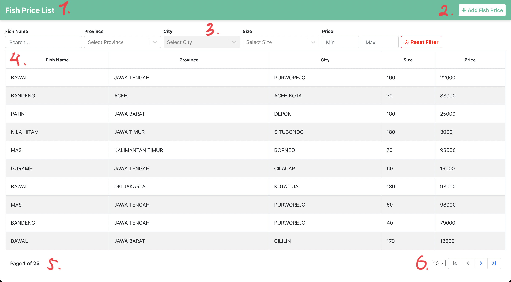
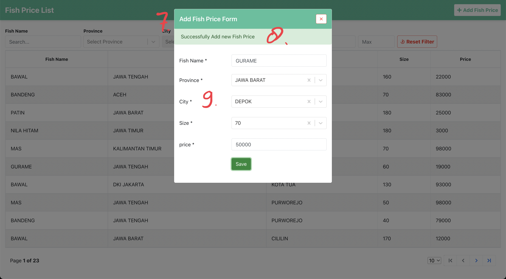

# UI Explanation

## Fish Price List Page

### 1. Page Title

- Menempatkan Title pada component header di ujung kiri memudahkan user untuk mengetahui halaman apa yang sedang dibuka

### 2. Add Fish Price Button

- Menempatkan Button `Add Fish Price` pada component header di ujung kanan memudahkan user untuk melakukan aksi, karena Header akan tetap terlihat walaupun scroll kebawah.

### 3. Table Filter

- Menempatkan Fitur filter tepat diatas component table memudahkan user untuk melakukan filter, dan setiap field sudah responsive
- Terdapat Button `Reset Filter` untuk reset seluruh filter yang sudah dilakukan

### 4. Table

- Membuat warna row Table selang-seling, dapat memudahkan user untuk membedakan antar row
- Menempatkan fitur `sort` pada header tiap kolum memudahkan user untuk sort berdasarkan kolom yang diinginkan
- Table akan tertutupi component `Loading Overlay` ketika sedang load data ke server
- Terdapat component untuk memberi tahu bahwa data kosong

### 5. Pagination meta

- Menempatkan halaman saat ini & jumlah halaman di pojok kiri dapat memudahkan user untuk mengetahui posisi halaman yang sedang dibuka & seberapa halaman yang tersedia.

### 6. Pagination action

- Fitur untuk merubah halaman yang akan dibuka, seperti ke halaman awal, ke halaman sebelumnya, ke halaman selanjutnya, & ke halaman terakhir
- Fitur untuk mengatur jumlah data yang dapat ditampilkan dalam 1 halaman

## Add Fish Price Modal

### 7. Add Fish Price Modal

- Fitur `Add Fish Price` menggunakan modal memudahkan user agar tidak perlu lagi navigasi ke halaman lain, karena form yang dibuat tidak terlalu kompleks

### 8. Alert success

- Fitur menampilkan alert ketika user berhasil / gagal menambahkan data ke server, akan tampil selama 3 detik

### 9. Fish Price Form

- Fish Price Form menggunakan component `json-reactform` yang di extend untuk memenuhi requirement
- Form akan tertutupi component `Loading Overlay` ketika sedang submitting data ke server
